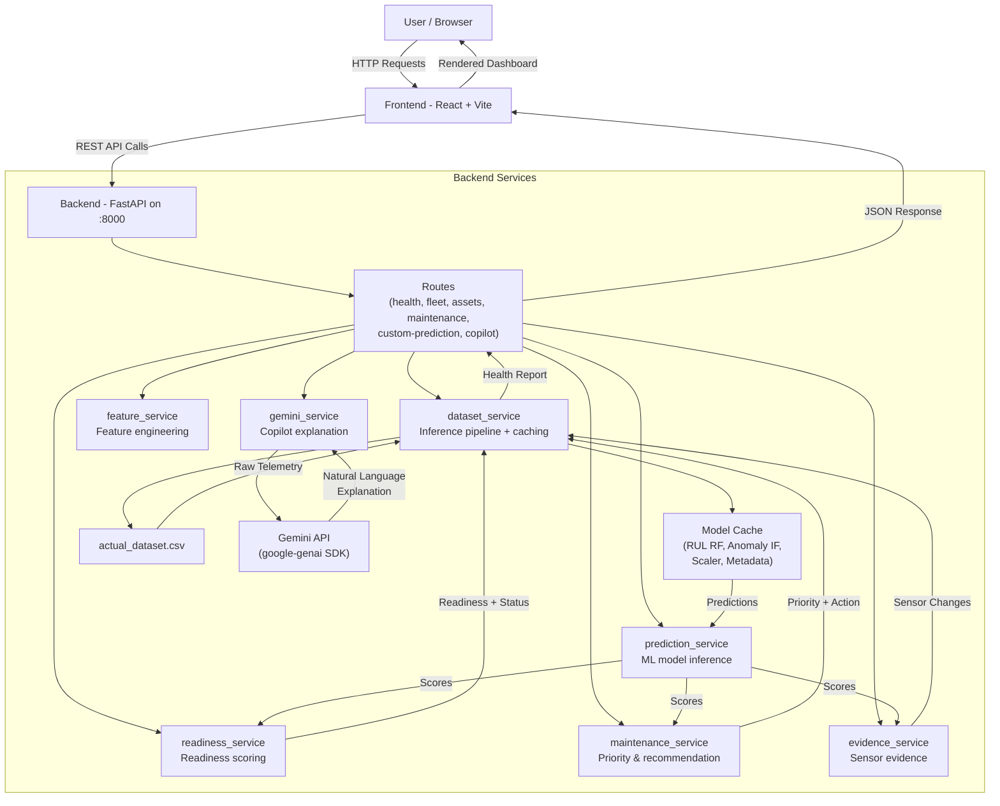

# Architecture

## System Architecture

## Components

| Component | Technology | Responsibility |
|---|---|---|
| Frontend | React 18 + Vite + Recharts | Dashboard UI, fleet/asset visualization, real-time charts |
| Backend API | FastAPI + uvicorn | REST API, request routing, CORS, error handling |
| Feature Engineering | pandas + numpy | Rolling mean/std, trend slopes, sensor filtering (window=10) |
| ML Models (RUL) | scikit-learn Random Forest | Predicts Remaining Useful Life in cycles |
| ML Models (Anomaly) | scikit-learn Isolation Forest | Detects anomalous operating patterns |
| ML Model Persistence | joblib (.pkl) | Serialized model artefacts cached at startup |
| Scoring Services | Python (custom) | Mission readiness, maintenance priority, status classification |
| Copilot / Explanation | Google Gemini API (gemini-3.6-flash) | Natural-language explanation of ML results |
| Data Source | CSV (actual_dataset.csv) | Fleet telemetry data, loaded and cached in-memory |
| Caching | functools.lru_cache + module-level dict | Fleet snapshot, dataset, model artefacts cached to avoid recomputation |

## Data Flow

### End-to-End: Fleet Dashboard

1. User opens the dashboard → React app calls `GET /api/fleet`
2. FastAPI route calls `dataset_service.get_fleet_snapshot()`
3. `dataset_service` loads `actual_dataset.csv` (cached via `lru_cache`), engineers features via `feature_service.engineer_features()`
4. For each asset, `dataset_service.build_asset_report()` invokes the pipeline:
   - **`prediction_service.score_asset()`** → loads cached models (Random Forest for RUL, Isolation Forest for anomaly), produces raw predictions
   - Scores converted via formulas:
     - `RUL Score = clip((predicted_RUL / 150) * 100, 0, 100)`
     - `Anomaly Severity = clip((healthy_max - anomaly_score) / (healthy_max - healthy_min) * 100, 0, 100)`
   - **`readiness_service.assess_readiness()`** → `Mission Readiness = clip(0.6 * RUL_Score + 0.4 * Anomaly_Health, 0, 100)` → bucketed into READY / CAUTION / CRITICAL
   - **`maintenance_service.assess_maintenance()`** → `Priority = clip(0.5*(100-RUL_Score) + 0.3*Anomaly_Severity + 0.2*(100-Mission_Readiness), 0, 100)` → HIGH / MEDIUM / LOW + recommendation text
   - **`evidence_service.get_sensor_changes()`** → compares recent vs. prior sensor windows, returns top-5 changed sensors
5. Results cached (fleet snapshot, `lru_cache`) → returned as JSON to frontend
6. React renders fleet summary and per-asset health cards/charts

### End-to-End: Asset Detail + Copilot

1. User selects an asset → React calls `GET /api/assets/{asset_id}`
2. Backend returns full report including telemetry history (last 10 cycles)
3. React calls `GET /api/copilot/{asset_id}`
4. Backend retrieves the ML report, sends it to **Gemini API** with a strict prompt:
   - Gemini receives structured health data only — it must NOT invent failures, sensor values, or override ML classifications
   - Returns natural-language ASSESSMENT / KEY EVIDENCE / RECOMMENDED ACTION
5. If Gemini is unavailable (no API key or error), a deterministic fallback explanation is generated from the ML results
6. Response returned to frontend for display alongside the asset detail view

### End-to-End: Custom Prediction

1. User uploads a CSV or enters 10 cycles of telemetry → React calls `POST /api/custom-prediction` (or `/api/custom-prediction/upload`)
2. Backend validates input (required sensors, min 10 cycles, numeric values)
3. Same feature-engineering and ML pipeline runs as dataset mode (shared code — no divergence)
4. Full health report returned with scores, status, recommendation, and sensor evidence

## Security Considerations

- **API keys** stored in `.env` file (gitignored), loaded via `python-dotenv`. `GEMINI_API_KEY` never committed to version control.
- **CORS** explicitly configured via `CORS_ORIGINS` environment variable — only known frontend origins permitted.
- **Input validation** enforced via Pydantic schemas (`TelemetryCycle`, `CustomPredictionRequest`) with strict type checking, range constraints, and `extra="forbid"` to reject unexpected fields.
- **Asset ID validation** — custom prediction asset IDs validated against alphanumeric/hyphen/underscore pattern only.
- **Gemini prompt injection guardrails** — copilot prompt explicitly instructs the model NOT to invent data, override scores, or claim safety. Fallback explanation always available.
- **No persistent user data** — all processing is stateless per request; no user credentials or PII handled.

## Scalability Notes

- **FastAPI is stateless** — can be horizontally scaled behind a load balancer (e.g., nginx, Kubernetes). Session state is not stored server-side.
- **Model caching** at module level avoids reloading ML artefacts per request; however, the cache is per-process, so each replica loads its own copy.
- **LRU caching** for dataset and fleet snapshot prevents redundant computation on repeated requests but means results are stale until server restart. A production deployment should add cache invalidation or TTL-based refresh.
- **Gemini API calls** are the primary external bottleneck for copilot endpoints. Rate limiting and request queuing should be added under heavy load.
- **Dataset size** is currently held entirely in memory (pandas DataFrame). For very large fleets, consider lazy loading per-asset or streaming from a database instead of a monolithic CSV.
- **No database** — the current prototype uses in-memory caching only. A production system would replace CSV + lru_cache with PostgreSQL/Redis for persistence and shared cache across replicas.
