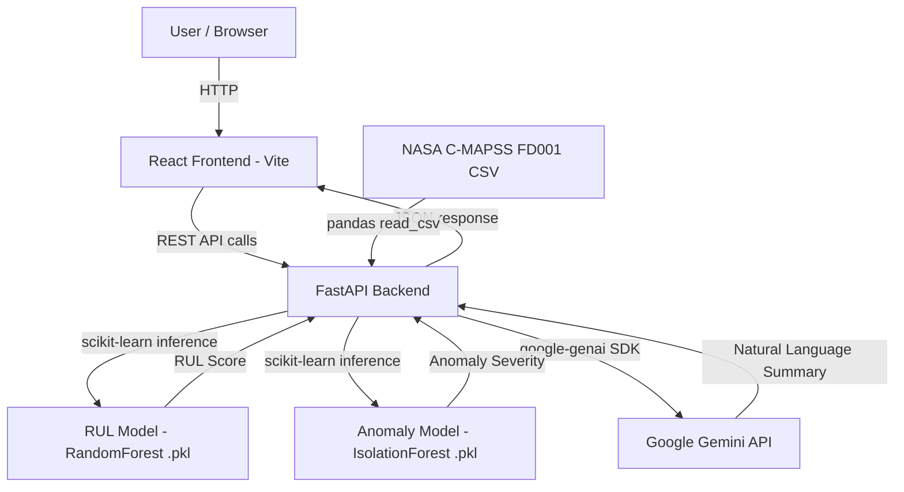

# InsightX — Bob AI Innovation Hackathon Submission Guide

This document explains how the **InsightX** submission is structured and how
evaluators can navigate, run, and assess it.

---

## Table of Contents

1. [Overview](#1-overview)
2. [Team](#2-team)
3. [Repository Structure](#3-repository-structure)
4. [File-by-File Walkthrough](#4-file-by-file-walkthrough)
   - [submission.yaml](#41-submissionyaml)
   - [README.md](#42-readmemd)
   - [docs/](#43-docs)
   - [src/](#44-src)
   - [demo/](#45-demo)
   - [presentation/](#46-presentation)
5. [How to Run](#5-how-to-run)
6. [Submission Checklist](#6-submission-checklist)
7. [How Our Entry Is Evaluated](#7-how-our-entry-is-evaluated)
8. [Known Limitations](#8-known-limitations)
9. [FAQ](#9-faq)

---

## 1. Overview

**InsightX** is a Mission Readiness & Predictive Maintenance Copilot built for
the IBM Bob AI Hackathon. It ingests NASA C-MAPSS FD001 turbofan engine
telemetry, computes per-asset health scores using machine learning, and
surfaces priority-ranked maintenance actions through a React dashboard. A
Google Gemini-powered AI Copilot translates ML outputs into natural-language
health summaries for non-expert users.

**Track:** AI
**Team:** InsightX (Daksh Vekariya, Kunj Thummar, Jayrajsinh Barad)

---

## 2. Team

| Field | Value |
|---|---|
| **Team Name** | InsightX |
| **Track** | AI |
| **Team Lead** | Daksh Vekariya — 24IT107@charusat.edu.in |
| **Members** | Kunj Thummar (24ce128@charusat.edu.in), Jayrajsinh Barad (24ce006@charusat.edu.in) |

---

## 3. Repository Structure

```
bob-ai-hackathon-InsightX/
|
+-- submission.yaml          <- Structured metadata - READ BY EVALUATORS FIRST
+-- README.md                <- Project overview - human-readable entry point
|
+-- src/                     <- All source code
|   +-- .env.example         <- Template for environment variables
|   +-- README.md            <- Architecture, ML pipeline, API reference
|   +-- backend/             <- FastAPI Python backend
|   |   +-- app/
|   |   |   +-- main.py      <- FastAPI entry point
|   |   |   +-- routes/      <- API endpoint handlers
|   |   |   +-- services/    <- ML inference, Gemini, dataset logic
|   |   |   +-- schemas/     <- Pydantic models
|   |   |   +-- models/      <- Saved .pkl model files (pre-trained)
|   |   |   +-- data/        <- actual_dataset.csv (NASA C-MAPSS FD001)
|   |   +-- scripts/
|   |   |   +-- download_dataset.py   <- Downloads dataset from HuggingFace
|   |   |   +-- train_models.py       <- Trains RUL + anomaly models
|   |   +-- requirements.txt
|   +-- frontend/            <- React + Vite frontend
|       +-- src/
|       |   +-- pages/       <- Dashboard, Fleet, Maintenance, Copilot, etc.
|       |   +-- components/  <- Reusable UI components
|       |   +-- services/api.js
|       +-- package.json
|
+-- docs/                    <- Written documentation
|   +-- problem-statement.md <- The industrial fleet monitoring problem
|   +-- solution-overview.md <- How InsightX works conceptually
|   +-- architecture.md      <- Technical architecture (diagram + explanation)
|   +-- setup-guide.md       <- Exact steps to run the project locally
|   +-- template-guide.md    <- This file - submission navigation guide
|
+-- demo/                    <- Demo artifacts
|   +-- demo-video-link.txt  <- URL to demo video
|   +-- live-demo-url.txt    <- URL to deployed demo (or "NOT DEPLOYED")
|   +-- screenshots/         <- App screenshots (at least 3)
|
+-- presentation/            <- Slide deck (slides.pdf or slides.pptx)
|
+-- CONTRIBUTING.md          <- Submission instructions
+-- .gitignore               <- Pre-configured
+-- .github/
    +-- workflows/
        +-- validate.yml     <- Automated submission validator
```

---

## 4. File-by-File Walkthrough

### 4.1 `submission.yaml`

First file evaluators read. All required fields are filled:

- **team.name**: InsightX
- **team.track**: AI
- **team.lead**: Daksh Vekaria (24IT107@charusat.edu.in)
- **members**: Kunj Thummar, Jayrajsinh Barad, Harsh Thesiya
- **title**: InsightX — Mission Readiness & Predictive Maintenance Copilot
- **problem_statement**: Industrial fleets lack real-time asset health visibility
- **solution_summary**: ML pipeline (Random Forest RUL + Isolation Forest) + Gemini Copilot
- **key_features**: 5 specific implemented features
- **tech_stack**: Python, FastAPI, React, scikit-learn, Google Gemini
- **known_limitations**: Simulated benchmark data, prototype thresholds

---

### 4.2 `README.md`

Human-readable front page. Covers:

- Team info and track
- Problem statement (industrial fleet health monitoring)
- Solution summary (ML pipeline + Gemini Copilot)
- Key features with brief descriptions
- Full tech stack table (Python, FastAPI, React, scikit-learn, Gemini)
- Quick-start run commands (mirrored from `docs/setup-guide.md`)
- Demo links (video, live URL, screenshots)
- Known limitations (simulated data, prototype thresholds)
- What we are most proud of (end-to-end ML pipeline faithfulness)

---

### 4.3 `docs/`

Four documentation files, each with a specific purpose:

#### `docs/problem-statement.md`

Covers the specific audience (maintenance engineers, fleet operators), why
fixed-schedule maintenance fails for high-cycle machinery, quantified pain
(unplanned downtime, cost overruns), and why no off-the-shelf tool surfaces
per-asset readiness in real time.

#### `docs/solution-overview.md`

Explains the core mechanism step by step:

1. Telemetry ingestion from NASA C-MAPSS FD001 dataset
2. Feature engineering — 10-cycle rolling mean, std, and trend per sensor
3. RUL prediction (Random Forest) → RUL Score (0–100)
4. Anomaly detection (Isolation Forest) → Anomaly Severity + Health
5. Mission Readiness = `0.6 x RUL_Score + 0.4 x Anomaly_Health`
6. Gemini Copilot generates natural-language explanation (non-modifying)

Key design decisions (e.g., why Isolation Forest over statistical thresholds,
why Gemini is explanatory-only) are documented in a table.

#### `docs/architecture.md`

Includes a Mermaid system diagram, a component responsibility table, a
step-by-step data flow (from raw CSV to feature engineering to ML inference to
API response to React dashboard), security notes (env vars, CORS), and
scalability notes.



#### `docs/setup-guide.md`

The most critical doc for judges — fully written and tested. Covers:

- Prerequisites (Python 3.10+, Node 18+, optional Gemini API key)
- Environment variables for both backend and frontend
- Step-by-step install commands (venv, pip, npm)
- Dataset download + model training scripts
- Running both servers
- URL table (frontend, backend, Swagger, health check)
- Quick demo walkthrough per page/route
- Troubleshooting table (10 common errors with exact fixes)

---

### 4.4 `src/`

All source code lives here:

```
src/
+-- .env.example        <- All environment variables with descriptions
+-- README.md           <- Full architecture, ML pipeline, API reference
+-- backend/            <- FastAPI + ML (Python)
+-- frontend/           <- React 18 + Vite dashboard
```

**Key rules followed:**
- `.env` is gitignored — no real credentials committed
- `.env.example` documents every required variable
- `node_modules/`, `.venv/`, and build artefacts are excluded via `.gitignore`
- Pre-trained `.pkl` models are committed so judges can skip re-training

**ML Pipeline:**

| Step | Detail |
|---|---|
| Feature engineering | 10-cycle rolling mean, std, trend per sensor (15 sensors, 64 total features) |
| RUL model | RandomForestRegressor — n_estimators=150, max_depth=20, R2 approx 0.75 |
| Anomaly model | IsolationForest — n_estimators=200, contamination=0.05 |
| Readiness formula | clip(0.6 x RUL_Score + 0.4 x Anomaly_Health, 0, 100) |
| Priority formula | clip(0.5*(100-RUL_Score) + 0.3*Anomaly_Severity + 0.2*(100-Readiness), 0, 100) |

**API Endpoints:**

| Method | Endpoint | Description |
|---|---|---|
| GET | /api/health | Health check |
| GET | /api/fleet | All 200 assets latest health summary |
| GET | /api/assets/{asset_id} | Detailed report + sensor evidence + history |
| GET | /api/maintenance | Priority-ranked maintenance plan |
| POST | /api/custom-prediction | Run ML on custom 10-cycle JSON telemetry |
| POST | /api/custom-prediction/upload | Run ML on uploaded CSV |
| GET | /api/copilot/{asset_id} | Gemini natural-language health explanation |

---

### 4.5 `demo/`

| File | Content |
|---|---|
| `demo-video-link.txt` | URL to 3-5 min demo video showing app running end-to-end |
| `live-demo-url.txt` | Deployed URL or NOT DEPLOYED |
| `screenshots/` | At least 3 screenshots of the running application |

Recommended screenshots:
- `01-home-dashboard.png` — Fleet KPI cards + readiness distribution chart
- `02-fleet-table.png` — Searchable/filterable asset table
- `03-asset-detail.png` — Per-asset health report + sensor evidence
- `04-maintenance-plan.png` — HIGH/MEDIUM/LOW maintenance plan
- `05-copilot.png` — Gemini AI Copilot explanation page

---

### 4.6 `presentation/`

Slide deck at `presentation/slides.pdf` (or `.pptx`) covering:

1. **Problem** — industrial fleet monitoring gap, unplanned downtime cost
2. **Solution** — InsightX architecture and ML pipeline
3. **Demo / Architecture** — Mermaid diagram + dashboard screenshots
4. **IBM Technology Integration** — IBM Bob AI Hackathon platform usage
5. **Impact** — how this scales to real defence/industrial deployments

---

## 5. How to Run

> Full instructions in [`docs/setup-guide.md`](setup-guide.md)

```bash
# 1. Clone
git clone https://github.com/KunjThummar/bob-ai-hackathon-InsightX.git
cd bob-ai-hackathon-InsightX/src

# 2. Backend
cd backend
python -m venv .venv
.venv\Scripts\activate          # Windows
# source .venv/bin/activate     # macOS/Linux
pip install -r requirements.txt

# Skip if .pkl files already exist in backend/app/models/
python scripts/download_dataset.py
python scripts/train_models.py

# 3. Create backend/.env
# GEMINI_API_KEY=your_key_here
# GEMINI_MODEL=gemini-2.5-flash
# CORS_ORIGINS=http://localhost:5173,http://127.0.0.1:5173

# 4. Frontend
cd ../frontend
npm install

# 5. Run (two terminals)
# Terminal 1 - Backend:
uvicorn app.main:app --host 0.0.0.0 --port 8000 --reload

# Terminal 2 - Frontend:
npm run dev
```

| Service | URL |
|---|---|
| **Frontend** | http://localhost:5173 |
| **Backend API** | http://localhost:8000 |
| **Swagger UI** | http://localhost:8000/docs |
| **Health Check** | http://localhost:8000/api/health |

---

## 6. Submission Checklist

**Content**
- [x] `submission.yaml` — all required fields filled
- [x] `README.md` — no placeholder text remaining
- [x] `docs/problem-statement.md` — written with actual project content
- [x] `docs/solution-overview.md` — written with actual project content
- [x] `docs/architecture.md` — Mermaid diagram and explanation present
- [x] `docs/setup-guide.md` — tested end-to-end, troubleshooting table included
- [x] `src/` — all source code committed, `.env.example` updated
- [ ] `demo/demo-video-link.txt` — replace placeholder with real video URL
- [ ] `demo/screenshots/` — add at least 3 screenshots of the running app
- [ ] `presentation/slides.pdf` — add slide deck

**Technical**
- [x] No `.env` files committed (`.gitignore` covers `.env`)
- [x] No `node_modules/`, `.venv/`, or build artefacts committed
- [ ] GitHub Actions Validate Submission is green
- [ ] Repository is Public

**Submission**
- [ ] Entry form submitted before the deadline
- [ ] Repo URL is correct in the form

---

## 7. How Our Entry Is Evaluated

| # | Criterion | Pts | InsightX Evidence |
|---|---|---|---|
| 1 | Technical Implementation Quality | 25 | End-to-end ML pipeline in `src/backend/`; faithful C-MAPSS feature engineering; pre-trained models committed |
| 2 | Innovation & Differentiation | 25 | Composite Mission Readiness formula; Gemini Copilot as explanatory (non-modifying) layer; custom telemetry prediction endpoint |
| 3 | Problem Depth & Vision | 15 | `docs/problem-statement.md` — quantified downtime cost, specific persona, gap analysis |
| 4 | Working Demo & Functionality | 15 | 7 API endpoints; 6 frontend pages; fully reproducible via `docs/setup-guide.md` |
| 5 | IBM Bob Integration | 10 | Submitted through IBM Bob AI Hackathon platform |
| 6 | Documentation & Reproducibility | 10 | Detailed setup guide, troubleshooting table, Swagger UI, pre-trained models |

---

## 8. Known Limitations

| Limitation | Detail |
|---|---|
| Simulated data | NASA C-MAPSS FD001 is a benchmark dataset, not real fleet telemetry |
| Model accuracy | RUL model: MAE approx 24 cycles, RMSE approx 33, R2 approx 0.75 — prototype grade |
| Readiness weights | 0.6/0.4 split is a prototype design choice, not domain-validated |
| No authentication | All API routes are open — not production-ready |
| Gemini dependency | Copilot requires a Gemini API key; falls back gracefully without one |
| Train engines | C-MAPSS train engines are at end-of-life (RUL=0) so they appear CRITICAL by design |

---

## 9. FAQ

**Q: Where is the actual source code?**
All code is inside `src/`. Backend is `src/backend/` (FastAPI + Python), frontend is `src/frontend/` (React + Vite).

**Q: Do I need a Gemini API key to run the app?**
No — the Copilot page returns a deterministic fallback explanation if `GEMINI_API_KEY` is missing. All other pages work fully without it.

**Q: Do I need to train the models?**
Only if the `.pkl` files are missing from `src/backend/app/models/`. If they are committed, skip the download and train scripts. Training takes approximately 2-5 minutes.

**Q: What dataset does this use?**
NASA C-MAPSS FD001 turbofan engine simulation data from HuggingFace (`SoyVitou/NASA-C-MAPSS-Turbofan-Engine`). The combined dataset has 200 unique assets (100 train + 100 test engines).

**Q: What does Mission Readiness mean?**
A 0-100 composite score: `clip(0.6 x RUL_Score + 0.4 x Anomaly_Health, 0, 100)`.
>=80 = READY, >=50 = CAUTION, <50 = CRITICAL.

**Q: The GitHub Action is failing — what do I do?**
Check the Actions tab and read the error. Most common causes: missing or empty required fields in `submission.yaml`, or invalid YAML indentation.

---

*For questions about the hackathon, contact the organiser directly.*
